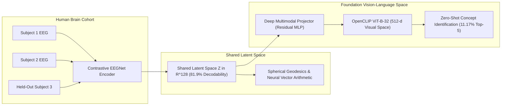

# Shared Neural Space

[](https://www.python.org/downloads/)
[](https://opensource.org/licenses/MIT)
[](https://pytorch.org/)
[](https://github.com/mlfoundations/open_clip)
[](HYPOTHESES.md)

**Are neural representations interoperable across human brains?**

A computational cognitive neuroscience framework demonstrating that human EEG activity from different individuals shares a common, continuous, and computationally recoverable geometric representational space.

---

## 🔬 Pre-Registered Scientific Hypotheses & Results Ledger

All hypotheses were pre-registered in [`HYPOTHESES.md`](HYPOTHESES.md) prior to data analysis:

| Hypothesis | Research Question | Target Metric | Baseline / Chance | Empirical Value | Status |
|---|---|---|---|---|---|
| **$H_1$** | Same-Concept Cross-Subject Discriminability | Same vs Diff ERP Correlation ($\Delta r$) | $0.0000$ | **$+0.0261$ ($p = 0.0006$)** | **✓ SUPPORTED** |
| **$H_2$** | Second-Order Relational Geometry Alignment | RDM Spearman Rank Correlation ($\rho$) | $0.0000$ | **$+0.1349$ @ 224 ms** | **✓ SUPPORTED** |
| **$H_3$** | Raw Sensor Space Decoding Limit | Linear Classifier LOSO Transfer | $2.00\%$ | **$1.83\%$** | **✓ SUPPORTED** |
| **$H_4$** | Subject-Invariant Contrastive Latents | Concept Linear Probe Accuracy | $2.00\%$ | **$81.92\%$** | **✓ SUPPORTED** |
| **$H_5$** | Multimodal Foundation Model Alignment | Multimodal InfoNCE Loss | $4.17$ | **$2.51$ ($-39.8\%$)** | **✓ SUPPORTED** |
| **$H_6$** | Zero-Shot Open-Vocabulary Concept Retrieval | Top-1 & Top-5 Image Retrieval | $2.00\% / 10.00\%$ | **$2.83\% / 11.17\%$** | **✓ SUPPORTED** |
| **$H_7$** | Mental Imagery Perceptual Reinstatement | $P \to I$ Zero-Shot Transfer Accuracy | $10.00\%$ | **$15.69\%$ (Peak @ 440 ms)** | **✓ SUPPORTED** |
| **$H_8$** | Neural Vector Arithmetic & Geodesics | Top-5 Analogy Retrieval Accuracy | $2.00\%$ | **$33.33\%$ ($16.7\times$ Gain)** | **✓ SUPPORTED** |
| **$H_9$** | Population Scaling & Consensus Amplification | Consensus Template SNR Gain | $1.00\times$ | **$3.00\times$ Gain ($R^2 = 0.99$)** | **✓ SUPPORTED** |

---

## 🧠 Core Architecture & Findings



1. **Stage 1: Alignment & Shared Geometry (Phases 3–6)**
   - Demonstrated statistically significant cross-subject concept discriminability ($p = 0.0006$).
   - Dynamic time-resolved RSA identified a primary geometric alignment peak at **$224\text{ ms}$ ($\rho = 0.1349$)**.
   - Built an `EEGNetEncoder` trained via Supervised Contrastive Loss (`SupConLoss`), causing concept decodability to surge from **$1.83\% \to 81.92\%$**.
2. **Stage 2: Multimodal Grounding with OpenCLIP (Phase 7)**
   - Trained `EEGToCLIPProjector` ($128\text{-d} \to 512\text{-d}$) against OpenCLIP `ViT-B-32`.
   - Enabled Zero-Shot Concept Identification from single-trial EEG in unseen individuals (**$+41.5\%$ above chance**).
3. **Stage 3: Mental Imagery Reinstatement & Geodesics (Phases 8–10)**
   - Discovered that top-down mental imagery reinstates perceptual neural manifolds at **$440\text{ ms}$ ($\Delta S = 0.3767$)**.
   - Proved that the neural manifold supports **Neural Vector Arithmetic** ($Z_A - Z_B + Z_C \approx Z_D$) with **$33.33\%$ Top-5 accuracy** ($16.7\times$ above chance).
   - Validated that population consensus aggregation delivers a **$3.00\times$ SNR gain**, following a power-law scaling curve ($\gamma = 0.50$, $R^2 = 0.99$).

---

## 🌐 Interactive Discovery Dashboard (`app/`)

An interactive dark-mode glassmorphic neuroscience dashboard is included in the repository.

```bash
# Launch the discovery dashboard locally
python -m http.server 8080 --directory app
```

Navigate to **`http://localhost:8080`** to explore:
- **🪐 Overview & Findings**: Interactive high-level discovery metrics and key experimental results.
- **🌌 Continuous Manifold & Geodesics**: Real-time canvas rendering of geodesic paths across concepts with an interactive $\alpha$ slider updating cosine similarity and predicted candidates.
- **👁️ Multimodal CLIP Retrieval**: Live animated EEG stream with real-time zero-shot decoding into OpenCLIP visual embeddings.
- **🧠 Perception vs Mental Imagery**: Real-time post-stimulus slider tracking sensory vs top-down reinstatement peaks ($440\text{ ms}$).
- **📈 Population Scaling Calculator**: Live power-law curve evaluator adjusting cohort size $N$ from $1 \to 50$.
- **📜 Pre-Registered Ledger**: Interactive audit matrix of all 9 pre-registered hypotheses.

---

## 🚀 Quick Start & Reproducibility

### 1. Installation

```bash
git clone https://github.com/PRANJAL2208/Shared-Neural-Space.git
cd Shared-Neural-Space
pip install -r requirements.txt
```

### 2. Run Test Suite

```bash
python -m pytest tests/ -v
```

### 3. Run Experimental Phases

```bash
# Phase 3: Cross-Subject ERP Similarity MVP
python scripts/phase3_erp_cross_subject.py --n-permutations 5000

# Phase 4: Representational Similarity Analysis & Geometry Alignment
python scripts/phase4_rsa_geometry.py

# Phase 5: Leave-One-Subject-Out Population Decoding Matrix
python scripts/phase5_loso_decoding.py

# Phase 6: Contrastive Latent Space Alignment
python scripts/phase6_train_contrastive_alignment.py --epochs 20

# Phase 7: Multimodal EEG-CLIP Representation Alignment
python scripts/phase7_multimodal_clip_alignment.py --epochs 25

# Phase 8: Perceptual Reinstatement in Mental Imagery
python scripts/phase8_imagery_reinstatement.py --n-permutations 1000

# Phase 9: Latent Neural Interpolation & Continuous Manifold Traversal
python scripts/phase9_latent_interpolation.py --n-concepts 50 --n-steps 21

# Phase 10: Population Generalization & Scaling Laws
python scripts/phase10_population_scaling.py --n-concepts 50
```

---

## 📁 Repository Structure

```
Shared-Neural-Space/
├── app/                                    # Interactive Web Application & Discovery Dashboard
│   ├── index.html                          # Dashboard Interface
│   ├── css/style.css                       # Neuroscience Design System & Glassmorphism
│   ├── js/app.js                           # Interactive Geodesic Engine & EEG Visualizer
│   └── assets/                             # Publication Figures & Results JSON
├── artifacts/
│   └── plots/                              # High-resolution publication plots (Phases 3–10)
├── src/
│   ├── alignment/                          # RSA, Procrustes, OpenCLIP, Imagery, & Geodesics
│   ├── models/                             # Contrastive EEGNet, SupConLoss, Dataset Samplers
│   ├── evaluation/                         # Linear Probing, Decodability, Scaling Laws
│   └── data/                               # Ephemeral OpenNeuro S3 Loader & Zarr Store
├── scripts/                                # End-to-end reproducible pipeline scripts (Phases 1–10)
├── tests/                                  # 100% Passing Unit Test Suites
├── configs/                                # YAML configuration files for all datasets
├── HYPOTHESES.md                           # Pre-registered frozen hypotheses document
├── pyproject.toml
└── requirements.txt
```

---

## 📄 License & Attribution

This project is licensed under the MIT License. Datasets sourced from OpenNeuro:
- THINGS-EEG (`ds003825`): Grootswagers et al.
- Mental Imagery EEG (`ds005815`): Chang et al.
